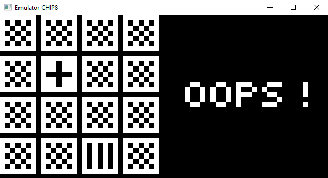
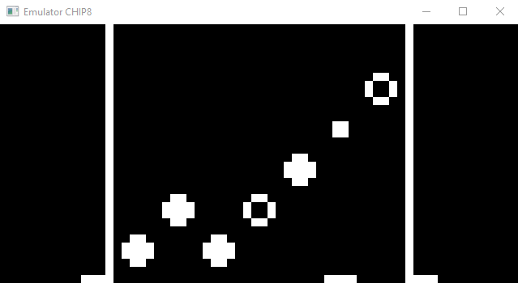

# EmulatorCHIP8

EmulatorCHIP8 is a simple CHIP-8 interpreter. You can pass it file for instance ```.\HIDDEN``` which contains binary game code. File is passed as an argument to the program ```.\EmulatorCHIP8.exe .\roms\HIDDEN``` and it will execute the program. It should report any errors it encounters.

## Keypad

Controls vary depending on the application. Usually it is ```Q```, ```W``` and ```E```.
```
Keypad                   Keyboard
+-+-+-+-+                +-+-+-+-+
|1|2|3|C|                |1|2|3|4|
+-+-+-+-+                +-+-+-+-+
|4|5|6|D|                |Q|W|E|R|
+-+-+-+-+       =>       +-+-+-+-+
|7|8|9|E|                |A|S|D|F|
+-+-+-+-+                +-+-+-+-+
|A|0|B|F|                |Z|X|C|V|
+-+-+-+-+                +-+-+-+-+
```





This was written with a ton of help from [this blog post](http://www.multigesture.net/articles/how-to-write-an-emulator-chip-8-interpreter/) by Laurence Muller.
